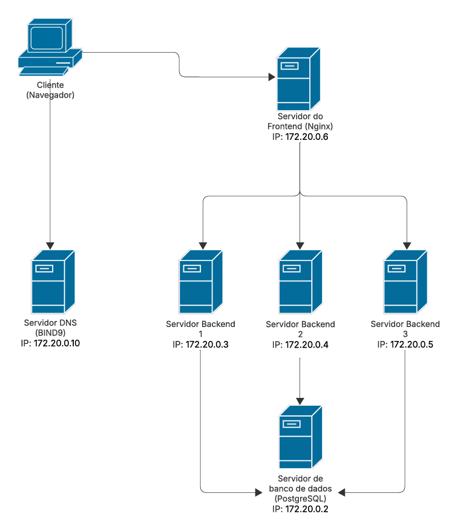

# Projeto de Redes - API de Sessão Centralizada

Este projeto é focado em demonstrar o gerenciamento de sessão de usuário em um ambiente distribuído.

A API é construída em Spring Boot e utiliza um banco de dados PostgreSQL para armazenar usuários e sessões ativas. O objetivo é simular como um usuário pode permanecer logado mesmo quando um balanceador de carga (DNS Round Robin) o direciona para diferentes servidores.

O sistema atende aos seguintes requisitos:
* **3 Servidores HTTP (Backend):** Distribuição de carga.
* **Banco de Dados Centralizado:** Persistência de usuários e sessões.
* **DNS Round Robin:** Balanceamento de carga na camada de rede.
* **Sessão Compartilhada:** O usuário permanece logado independente de qual servidor o atenda.

---

## Integrantes
- Arthur Ferraz
- Beatriz Brito
- Gabriel Alves
- Thawã Borges

## Tecnologias Utilizadas

* **Java 17 & Spring Boot 3**
* **PostgreSQL**
* **Nginx** Servidor de Frontend (Proxy Reverso)
* **BIND9** Servidor DNS
* **Docker & Docker Compose**
* **HTML/CSS/JS**

---

## Pré-requisitos

Para rodar este projeto, você **só precisa** ter duas coisas instaladas na sua máquina:

1.  **Git** (para baixar o projeto)
2.  **Docker Desktop** (para construir e rodar os servidores)

O docker vai cuidar sozinho dos outros requisitos

---

## Como Rodar (Passo a Passo)

### 1. Clone o Repositório

Abra seu terminal e clone este projeto:

```bash
git clone https://github.com/fd4dg4br1/Arquitetura-Distribuida-DNS.git
cd Arquitetura-Distribuida-DNS
```

---

### 2. Crie o Arquivo ".env"

Por segurança, as senhas não estão no GitHub. Você precisa criar este arquivo manualmente.

Na raiz do projeto (junto com o docker-compose.yml), crie um arquivo chamado .env

Copie e cole o conteúdo abaixo dentro dele:

```bash
DB_USER=nome-de-usuario
DB_PASS=senha
DB_NAME=nome-do-banco-de-dados
```

(Por que isso? O arquivo docker-compose.yml vai ler essas variáveis para configurar o banco de dados e a sua aplicação Spring automaticamente, sem expor as senhas no código.)

---

### 3. Suba o Ambiente
Com o *Docker Desktop aberto*, rode o seguinte comando no seu terminal:

```bash

docker-compose up --build
```

Aguarde alguns minutos. O Docker irá baixar as imagens, compilar o código Java, iniciar o banco de dados, criar as tabelas automaticamente e subir os 3 servidores de aplicação + DNS + Frontend.

Quando vir a mensagem Started DnsApplication nos logs, o sistema está pronto.

---

### 4. Configuração do Domínio (Opcional)
Para acessar via www.meutrabalho.com.br, adicione a seguinte linha ao seu arquivo hosts do Windows (C:\Windows\System32\drivers\etc\hosts):

```bash
127.0.0.1       www.meutrabalho.com.br
127.0.0.1       api.meutrabalho.com.br
```

Se não quiser configurar isso, acesse via **localhost**.


---

### 5. Como Testar (Usando o Swagger)

1. Acessar o Sistema (Frontend)
    Abra o navegador e acesse:
    * **Com domínio configurado:** [http://www.meutrabalho.com.br](http://www.meutrabalho.com.br)
    * **Sem domínio (Local):** [http://localhost](http://localhost)

2. Documentação da API (Swagger)
    Para testar os endpoints do Backend diretamente, você pode acessar qualquer um dos 3 servidores:
    * **Servidor 1:** [http://localhost:8080/swagger-ui/index.html](http://localhost:8080/swagger-ui/index.html)
    * **Servidor 2:** [http://localhost:8081/swagger-ui/index.html](http://localhost:8081/swagger-ui/index.html)
    * **Servidor 3:** [http://localhost:8082/swagger-ui/index.html](http://localhost:8082/swagger-ui/index.html)

3. Testar o DNS (Round Robin)
    Para provar que o DNS está distribuindo os IPs, abra o terminal (CMD) e digite:
    
    ```bash
    nslookup api.meutrabalho.com.br 127.0.0.1
    ```

---
---


## 🐧 Instruções para Usuários Linux / Mac

O processo é o mesmo, com pequenas diferenças:

1.  **Permissões:** Pode ser necessário usar `sudo` antes dos comandos docker:
    ```bash
    sudo docker compose up --build
    ```

2.  **Arquivo Hosts:**
    Edite o arquivo `/etc/hosts` para configurar o domínio:

    Abra o terminal.
    Digite: sudo nano /etc/hosts
    Adicione as linhas no final:
    ```bash
    127.0.0.1       www.meutrabalho.com.br
    127.0.0.1       api.meutrabalho.com.br
    ```

3.  **Conflito de Porta 53 (DNS):**
    Se der erro ao subir o BIND9, pare o resolvedor do sistema:
    ```bash
    sudo systemctl stop systemd-resolved
    ```

---

## Diagrama da Rede

Abaixo está o mapa da infraestrutura distribuída, com os IPs fixos configurados no Docker:

